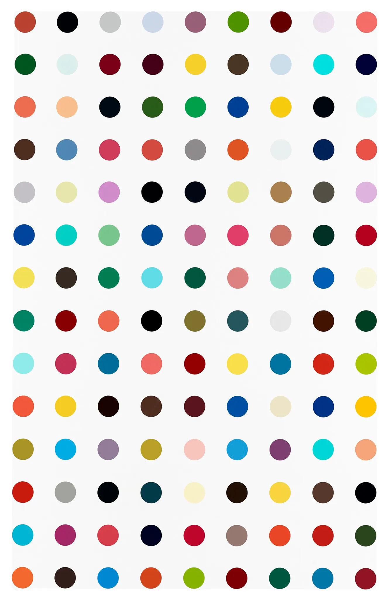
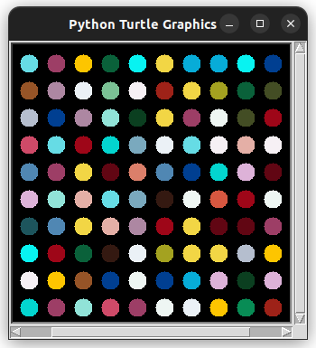

# Damien Hirst Painting using Python

Tejas [twitter](https://twitter.com/achte_te)

Using Python to recreate a Damien Hirst spot painting on a Black screen with colors drawn from an external image.

### Requirements:
[Colorgram](https://pypi.org/project/colorgram.py/)

[Turtle](https://docs.python.org/3/library/turtle.html)


To install Colorgram:

```sh
pip install colorgram.py
```

To Run:

```sh
git clone git@github.com:achte-2022/Hirst-Painting.git
cd Hirst-Painting
python3 main.py
```

### Source Image for Obtaining Colors:




### Output Image:


